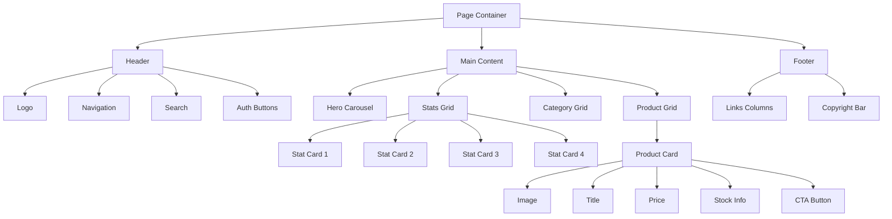

# Layout Design Reference - E-commerce Shop

> [!NOTE]
> เอกสารนี้อธิบายโครงสร้าง layout ของเว็บ e-commerce แบบ modern shop (อ้างอิงจาก Umarubux Shop) สำหรับใช้เป็นแนวทางในการออกแบบ

## Table of Contents
1. [Overall Structure](#overall-structure)
2. [Header/Navigation](#headernavigation)
3. [Hero Section](#hero-section)
4. [Statistics Cards](#statistics-cards)
5. [Category Section](#category-section)
6. [Product Grid](#product-grid)
7. [Footer](#footer)
8. [Responsive Layout](#responsive-layout)

---

## Overall Structure

### Page Container
```
┌─────────────────────────────────────────────┐
│              HEADER (Sticky)                 │
├─────────────────────────────────────────────┤
│                                              │
│         HERO SECTION (Carousel)              │
│                                              │
├─────────────────────────────────────────────┤
│         STATISTICS CARDS (Grid)              │
├─────────────────────────────────────────────┤
│      RECOMMENDED CATEGORIES (Grid)           │
├─────────────────────────────────────────────┤
│         PRODUCT LISTINGS (Grid)              │
│                                              │
│                 ...                          │
│                                              │
├─────────────────────────────────────────────┤
│                 FOOTER                       │
└─────────────────────────────────────────────┘
```

### Container System
- **Max Width:** `1280px` (container)
- **Padding (Desktop):** `0 2rem` (32px)
- **Padding (Mobile):** `0 1rem` (16px)
- **Center Alignment:** `margin: 0 auto`

---

## Header/Navigation

### Layout Structure
```
┌──────────────────────────────────────────────────────────────────┐
│  [Logo]  [เมนู1] [เมนู2] [เมนู3]  [Search Bar]  [Login] [Sign]  │
└──────────────────────────────────────────────────────────────────┘
```

### Grid Breakdown
```css
Header Container:
├── Logo Section (flex-shrink: 0)
│   ├── Width: ~200px
│   └── Logo + Site Name
│
├── Navigation Menu (flex: 0)
│   ├── Display: flex
│   ├── Gap: 2rem
│   └── Items: หน้าแรก | สินค้าทั้งหมด | เติมเงิน | ติดต่อเรา
│
├── Search Bar (flex: 1)
│   ├── Max Width: 600px
│   └── Margin: 0 auto
│
└── Auth Buttons (flex-shrink: 0)
    ├── Display: flex
    ├── Gap: 1rem
    └── Buttons: เข้าสู่ระบบ | สมัครสมาชิก
```

### Specifications
- **Height:** `70px` - `80px`
- **Position:** `sticky` top: 0
- **Z-index:** `50`
- **Display:** `flex`
- **Align Items:** `center`
- **Justify Content:** `space-between`

### Responsive Behavior
**Desktop (> 1024px):**
- Full menu visible
- Search bar centered
- All elements in one row

**Tablet (768px - 1024px):**
- Logo smaller
- Menu condensed
- Search bar narrower

**Mobile (< 768px):**
- Hamburger menu
- Logo left
- Login/Avatar right
- Search bar below or in dropdown

---

## Hero Section

### Layout Structure
```
┌────────────────────────────────────────────┐
│                                             │
│         [Carousel/Slideshow]                │
│                                             │
│         ● ○ ○  (Indicators)                 │
│                                             │
└────────────────────────────────────────────┘
```

### Specifications
- **Height:** `400px` - `500px` (Desktop)
- **Height:** `250px` - `300px` (Mobile)
- **Aspect Ratio:** `16:9` or `21:9`
- **Width:** `100%` of container
- **Margin Bottom:** `3rem` (48px)

### Carousel Component
```
Slide Container:
├── Image/Background (full width)
├── Overlay (gradient or semi-transparent)
└── Content Box
    ├── Heading (h1 or h2)
    ├── Description
    └── CTA Button (optional)
```

---

## Statistics Cards

### Layout Structure
```
┌──────────────────────────────────────────────────────────┐
│  ┌───────┐  ┌───────┐  ┌───────┐  ┌───────┐            │
│  │ [📊]  │  │ [📦]  │  │ [💰]  │  │ [👥]  │            │
│  │ 1,234 │  │ 5,678 │  │ 89,012│  │ 3,456 │            │
│  │ Label │  │ Label │  │ Label │  │ Label │            │
│  └───────┘  └───────┘  └───────┘  └───────┘            │
└──────────────────────────────────────────────────────────┘
```

### Grid System
```css
Container:
├── Display: grid
├── Grid Columns: repeat(4, 1fr)  /* Desktop */
├── Gap: 1.5rem (24px)
└── Margin Bottom: 3rem (48px)

Responsive:
├── Desktop (> 1024px): 4 columns
├── Tablet (768px - 1024px): 2 columns
└── Mobile (< 768px): 1 or 2 columns
```

### Card Structure
```
Card:
├── Padding: 1.5rem - 2rem
├── Min Height: 120px - 150px
├── Display: flex
├── Flex Direction: column
├── Align Items: center
└── Content:
    ├── Icon (top)
    ├── Number/Value (center, large)
    └── Label (bottom)
```

---

## Category Section

### Layout Structure
```
┌────────────────────────────────────────────────────┐
│              หมวดหมู่แนะนำ                          │
│  ┌────────┐ ┌────────┐ ┌────────┐ ┌────────┐      │
│  │ [IMG]  │ │ [IMG]  │ │ [IMG]  │ │ [IMG]  │      │
│  │Category│ │Category│ │Category│ │Category│      │
│  └────────┘ └────────┘ └────────┘ └────────┘      │
└────────────────────────────────────────────────────┘
```

### Grid System
```css
Container:
├── Display: grid
├── Grid Columns: repeat(auto-fill, minmax(200px, 1fr))
├── Gap: 1.5rem
└── Margin Bottom: 3rem

Card:
├── Aspect Ratio: 1:1 or 4:3
├── Display: flex
├── Flex Direction: column
├── Border Radius: 12px
└── Content:
    ├── Image (full width, top)
    └── Title (overlay or below)
```

### Responsive Grid
- **Desktop:** 4-6 columns
- **Tablet:** 3-4 columns
- **Mobile:** 2 columns

---

## Product Grid

### Layout Structure
```
┌────────────────────────────────────────────────────────────────┐
│                    สินค้าทั้งหมด                               │
│  ┌─────────┐ ┌─────────┐ ┌─────────┐ ┌─────────┐             │
│  │ [Image] │ │ [Image] │ │ [Image] │ │ [Image] │             │
│  │  Title  │ │  Title  │ │  Title  │ │  Title  │             │
│  │  Price  │ │  Price  │ │  Price  │ │  Price  │             │
│  │ [Button]│ │ [Button]│ │ [Button]│ │ [Button]│             │
│  └─────────┘ └─────────┘ └─────────┘ └─────────┘             │
│  ┌─────────┐ ┌─────────┐ ┌─────────┐ ┌─────────┐             │
│  │ [Image] │ │ [Image] │ │ [Image] │ │ [Image] │             │
│  │  Title  │ │  Title  │ │  Title  │ │  Title  │             │
│  │  Price  │ │  Price  │ │  Price  │ │  Price  │             │
│  │ [Button]│ │ [Button]│ │ [Button]│ │ [Button]│             │
│  └─────────┘ └─────────┘ └─────────┘ └─────────┘             │
└────────────────────────────────────────────────────────────────┘
```

### Grid System
```css
Container:
├── Display: grid
├── Grid Columns:
│   ├── Desktop: repeat(4, 1fr)
│   ├── Laptop: repeat(3, 1fr)
│   ├── Tablet: repeat(2, 1fr)
│   └── Mobile: repeat(1, 1fr) or repeat(2, 1fr)
├── Gap: 1.5rem - 2rem
└── Margin Bottom: 2rem
```

### Product Card Structure
```
Card Container:
├── Display: flex
├── Flex Direction: column
├── Height: 100%
│
├── Image Section (top)
│   ├── Aspect Ratio: 1:1 or 4:3
│   ├── Width: 100%
│   ├── Object Fit: cover
│   └── Border Radius: 12px 12px 0 0
│
├── Content Section (flex: 1)
│   ├── Padding: 1rem - 1.5rem
│   ├── Display: flex
│   ├── Flex Direction: column
│   ├── Gap: 0.5rem
│   │
│   ├── Title
│   │   ├── Font Size: 1rem - 1.125rem
│   │   ├── Line Height: 1.5
│   │   └── Max Lines: 2 (ellipsis)
│   │
│   ├── Price Section
│   │   ├── Display: flex
│   │   ├── Justify: space-between
│   │   ├── Original Price (if discount)
│   │   └── Sale Price
│   │
│   ├── Stock Info
│   │   ├── Font Size: 0.875rem
│   │   └── Text: "คงเหลือ X ชิ้น" or "ขายแล้ว X ชิ้น"
│   │
│   └── Button Section (margin-top: auto)
│       ├── Width: 100%
│       ├── Padding: 0.75rem
│       └── Border Radius: 8px
```

### Card Dimensions
- **Min Height:** `350px` - `400px`
- **Image Height:** `200px` - `250px`
- **Content Padding:** `1rem` - `1.5rem`

---

## Footer

### Layout Structure
```
┌──────────────────────────────────────────────────────┐
│  ┌─────────────┐ ┌─────────────┐ ┌─────────────┐    │
│  │   Column 1  │ │   Column 2  │ │   Column 3  │    │
│  │   Links     │ │   Links     │ │   Contact   │    │
│  └─────────────┘ └─────────────┘ └─────────────┘    │
│                                                       │
│  ─────────────────────────────────────────────────  │
│                                                       │
│     © 2025 Shop Name | Privacy | Terms | Partners   │
└──────────────────────────────────────────────────────┘
```

### Grid System
```css
Footer Container:
├── Display: grid
├── Grid Columns: repeat(3, 1fr)  /* Desktop */
├── Gap: 2rem
├── Padding: 3rem 2rem 1.5rem
│
└── Responsive:
    ├── Desktop: 3 columns
    ├── Tablet: 2 columns
    └── Mobile: 1 column
```

### Footer Sections
1. **Links Section** (multiple columns)
   - Quick links
   - Product categories
   - Support links

2. **Bottom Bar**
   - Copyright
   - Legal links
   - Social media icons
   - Partner badges

---

## Responsive Layout

### Breakpoints
```css
/* Mobile First Approach */

/* Mobile */
Default: < 640px
├── Container Padding: 1rem
├── Font Scale: 0.875 - 1rem
└── Grid: 1-2 columns

/* Tablet */
@media (min-width: 768px)
├── Container Padding: 1.5rem
├── Font Scale: 1rem - 1.125rem
└── Grid: 2-3 columns

/* Laptop */
@media (min-width: 1024px)
├── Container Padding: 2rem
├── Font Scale: 1rem - 1.25rem
└── Grid: 3-4 columns

/* Desktop */
@media (min-width: 1280px)
├── Container Max Width: 1280px
├── Container Padding: 2rem
└── Grid: 4+ columns

/* Large Desktop */
@media (min-width: 1536px)
├── Container Max Width: 1536px
└── Increased spacing
```

### Responsive Grid Template
```css
.product-grid {
  display: grid;
  gap: 1.5rem;
  
  /* Mobile: 1 column or 2 narrow columns */
  grid-template-columns: 1fr;
  
  /* Tablet: 2-3 columns */
  @media (min-width: 640px) {
    grid-template-columns: repeat(2, 1fr);
  }
  
  /* Laptop: 3 columns */
  @media (min-width: 1024px) {
    grid-template-columns: repeat(3, 1fr);
  }
  
  /* Desktop: 4 columns */
  @media (min-width: 1280px) {
    grid-template-columns: repeat(4, 1fr);
  }
}
```

---

## Spacing System

### Consistent Spacing Scale
```
0.25rem =  4px  (xs)
0.5rem  =  8px  (sm)
0.75rem = 12px  (md)
1rem    = 16px  (base)
1.5rem  = 24px  (lg)
2rem    = 32px  (xl)
3rem    = 48px  (2xl)
4rem    = 64px  (3xl)
6rem    = 96px  (4xl)
```

### Section Spacing
```css
Between Major Sections:
├── Desktop: 4rem - 6rem (64px - 96px)
├── Tablet: 3rem - 4rem (48px - 64px)
└── Mobile: 2rem - 3rem (32px - 48px)

Within Sections:
├── Heading to Content: 1.5rem - 2rem
└── Between Items: 1rem - 1.5rem
```

---

## Grid Gap Reference

### Product Grids
- **Desktop:** `2rem` (32px)
- **Tablet:** `1.5rem` (24px)
- **Mobile:** `1rem` (16px)

### Category Grids
- **Desktop:** `1.5rem` (24px)
- **Tablet:** `1.5rem` (24px)
- **Mobile:** `1rem` (16px)

### Statistics Cards
- **All Devices:** `1.5rem` (24px)

---

## Layout Component Diagram



---

## Quick Reference: Common Layouts

### Full-Width Section
```css
.full-width-section {
  width: 100%;
  padding: 4rem 0;
}

.full-width-section .container {
  max-width: 1280px;
  margin: 0 auto;
  padding: 0 2rem;
}
```

### Grid Container
```css
.grid-container {
  display: grid;
  grid-template-columns: repeat(auto-fill, minmax(280px, 1fr));
  gap: 1.5rem;
}
```

### Flex Header
```css
.header {
  display: flex;
  align-items: center;
  justify-content: space-between;
  height: 70px;
  padding: 0 2rem;
}
```

### Card Component
```css
.card {
  display: flex;
  flex-direction: column;
  height: 100%;
  border-radius: 12px;
  overflow: hidden;
}

.card-image {
  width: 100%;
  aspect-ratio: 1 / 1;
  object-fit: cover;
}

.card-content {
  flex: 1;
  padding: 1rem;
  display: flex;
  flex-direction: column;
  gap: 0.5rem;
}

.card-button {
  margin-top: auto;
  width: 100%;
}
```

---

## Best Practices

### ✅ Do's
- ใช้ CSS Grid สำหรับ layout หลัก
- ใช้ Flexbox สำหรับ component ย่อยๆ
- กำหนด max-width สำหรับ container
- ใช้ responsive units (rem, em, %)
- ออกแบบ mobile-first
- ใช้ consistent spacing scale
- ให้ content มี breathing room

### ❌ Don'ts
- อย่าใช้ fixed widths สำหรับ responsive elements
- อย่าใช้ pixel values ทุกที่ (ใช้ rem/em)
- อย่าลืม gaps ระหว่าง grid items
- อย่าทำ layout ที่แคบเกินไปบน mobile
- อย่าใช้ breakpoints มากเกินไป

---

## Implementation Checklist

- [ ] กำหนด container max-width และ padding
- [ ] สร้าง responsive grid system
- [ ] ตั้งค่า spacing scale
- [ ] ออกแบบ mobile layout ก่อน
- [ ] เพิ่ม tablet breakpoint
- [ ] เพิ่ม desktop breakpoint
- [ ] ทดสอบบนหน้าจอขนาดต่างๆ
- [ ] ตรวจสอบ gap และ spacing
- [ ] ใช้ flexbox/grid อย่างเหมาะสม
- [ ] เพิ่ม hover states สำหรับ interactive elements

---

*Last Updated: 2025-11-25*
*Reference: Umarubux Shop Layout Analysis*
